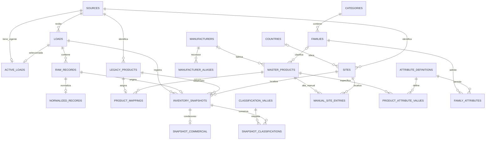

# Modelo entidad–relación propuesto para RLA

Estado: diseño objetivo, no migración ejecutada. Basado en las 42 columnas de Lista_Productos.xlsx
y en las decisiones de cargas completas por fuente, altas manuales y revisión de equivalencias.

## Qué representa cada registro

El Excel contiene una observación de un código de origen en un sitio. La combinación código–sitio
no se repite en este archivo, pero cuatro filas carecen de sitio y siguen en cuarentena.
Un código no es una unidad física serializada: no se recibió número de serie de cada equipo.
Por ello no se crea una tabla de activos individuales ni se inventan existencias por número de serie.

Se distinguen tres identidades: producto maestro, código dentro de una fuente y sitio dentro de una
fuente. Dos códigos pueden relacionarse con un maestro solo después de resolver su equivalencia.
Incluso si comparten maestro y sitio, se conservan sus observaciones separadas: sumar stock requiere
confirmar que no sean dos representaciones de las mismas existencias.

## Diagrama del núcleo objetivo

La notación muestra cardinalidades: || exactamente uno; o| cero o uno; o{ cero o muchos.

ACTIVE_LOADS debe apuntar a una carga de su misma fuente, validada y publicada atómicamente.
El país y la familia son opcionales mientras no estén confirmados. Las tablas de evidencia pueden
contener una fila antes de que exista su producto maestro o su fotografía publicada.

## Diccionario de tablas: núcleo

**sources — existente.** Una fuente de archivos completos. PK source_id; name único.
La fuente actual es RLA_Productos y no equivale a un país.

**loads — existente, ampliar.** Una recepción de archivo. PK load_id; FK source_id.
Campos: filename, sha256, received_at, row_count, status, validation_notes; agregar
snapshot_at opcional (fecha de corte declarada), sheet_name y versión del importador.
UNIQUE(source_id, sha256). Fecha de recepción y fecha de corte son conceptos diferentes.

**active_loads — existente.** Una selección vigente por fuente. PK source_id; FK compuesta
(source_id, load_id) hacia loads. No reconstruye ni elimina el historial.

**raw_records — existente.** Una fila original. PK raw_record_id; FK load_id;
excel_row y raw_json; UNIQUE(load_id, excel_row). Conserva todos los campos leídos,
incluidos los que no se transforman. No sustituye al archivo Excel como respaldo de estilos/fórmulas.

**normalized_records — existente.** Una transformación por fila en la versión actual.
PK/FK raw_record_id; normalized_json, rules_version. El JSON es apropiado para staging;
no se usa como sustituto de las relaciones y atributos tipados del catálogo operativo.

**manufacturers — nueva.** Una marca/fabricante canónico. PK manufacturer_id;
canonical_name y canonical_key única. No fusionar razones sociales distintas solo por parecido.

**manufacturer_aliases — nueva.** Una equivalencia aprobada de escritura en una fuente.
PK alias_id; FK manufacturer_id y source_id; alias_key, original_example, approved_by,
approved_at, reason. UNIQUE(source_id, alias_key). Una coincidencia automática de espacios/tildes
solo propone el alias; las decisiones aprobadas gobiernan el catálogo.

**categories — existente, redefinir.** Una categoría raíz. PK category_id; category_code único,
name, status. Hoy categories usa parent_id para jerarquía libre. Proponemos dos niveles explícitos
para impedir niveles mezclados: categories y families. Requiere migración, no renombrado directo.

**families — nueva.** Una familia dentro de una categoría. PK family_id; FK category_id;
family_code único; UNIQUE(category_id, name); plantilla de nombre versionada fuera de esta tabla.
MASTER_PRODUCTS almacena family_id, no category_id redundante: la categoría se obtiene de la familia.

**master_products — existente, modificar.** Una identidad de producto o servicio vendible/arrendable.
PK master_id y master_code generado estable; standard_name, product_type, manufacturer_id opcional,
model opcional, family_id opcional, package_type, serialization, origin, status y datos de creación.
Reemplazar manufacturer libre por FK; category_id por family_id. No crear UNIQUE(marca,modelo):
puede haber medidas, configuraciones o paquetes diferentes. No crear una tabla de modelos todavía:
el Excel no demuestra que cada modelo tenga identidad independiente ni una marca inequívoca.

**legacy_products — existente.** Un código en una fuente. PK legacy_id; FK source_id;
legacy_code como texto; UNIQUE(source_id, legacy_code). Conserva ceros iniciales y signos.

**product_mappings — existente.** Asignación vigente de código a maestro. PK/FK legacy_id;
FK master_id; método, autor, fecha y motivo. Un maestro admite muchos códigos. Los cambios
de asignación requieren auditoría; el historial no se reconstruye usando solo la asignación actual.

**countries — nueva.** País confirmado. PK country_id; country_code único y name.
No poblar automáticamente a partir del nombre o prefijo del producto.

**sites — existente, ampliar.** Un sitio identificado dentro de una fuente. PK site_id;
FK source_id y country_id opcional; source_site_code, name; UNIQUE(source_id, source_site_code).
Guardar nombre observado por carga en raw_records; name es la denominación vigente aprobada.
No deduplicar sitios de fuentes diferentes sin evidencia.

**inventory_snapshots — existente, ampliar.** Una observación de código–sitio en una carga.
PK snapshot_id; FK load_id, legacy_id, site_id, raw_record_id; unicidad (load_id, legacy_id, site_id).
Conservar source_id como control de integridad mediante FK compuestas: redundancia deliberada
para impedir cruces entre fuentes. Stock, condiciones operativas, bin_location, shelf_location,
maximum_qty, minimum_qty, reorder_qty y affects_availability pertenecen aquí provisionalmente.
Los campos financieros se trasladan a SNAPSHOT_COMMERCIAL. No restringir stock a valores positivos.

**snapshot_commercial — nueva.** Extensión opcional 1:1 de una observación. PK/FK snapshot_id;
cost, replacement_cost, reported_total_cost, retail_price, low_retail_price, msrp y currency_code
opcional. Mantiene el nivel de origen mientras RLA confirme alcance de precios y costos. No
calcular CostoTotal como Stock × Cost sin confirmar su significado. No sumar importes sin moneda.

**classification_values — nueva.** Etiqueta original de clasificación, no taxonomía canónica.
PK value_id; FK source_id; field_name y raw_value; UNIQUE(source_id, field_name, raw_value).
field_name restringido a las agrupaciones y códigos contables del mapeo. Dos etiquetas iguales
en campos diferentes no son necesariamente equivalentes.

**snapshot_classifications — nueva.** Relación entre observación y etiqueta original.
PK (snapshot_id, field_name); FK snapshot_id; FK compuesta (value_id, field_name) a
classification_values mediante índice único auxiliar. Garantiza una etiqueta por campo/fotografía.
Aunque muchas etiquetas hoy sean constantes por código, se retienen en su nivel de origen
para conservar cambios futuros y diferencias locales sin sobrescribir la categoría del maestro.

**manual_site_entries — existente.** Existencias o asociación manual de un maestro con un sitio.
PK entry_id; FK master_id, site_id; stock opcional, condiciones, estado, autor, fecha y motivo.
Alta manual de producto no requiere crear esta fila. UNIQUE parcial maestro–sitio para entradas activas.
No sumar automáticamente con inventario importado; reconciliar sus coincidencias explícitamente.

## Diccionario: atributos y gobierno

**attribute_definitions — nueva.** PK attribute_id; code único, name, data_type
(text/decimal/boolean), dimension. Ejemplos: longitud, conector A, resolución observada.

**units — nueva.** PK unit_id; symbol único, dimension. No inventar una unidad cuando falte.

**attribute_units — nueva.** PK (attribute_id, unit_id); FK a definiciones y unidades.
Establece combinaciones permitidas. Conversiones como m/cm requieren factores explícitos;
W y VA no se consideran intercambiables.

**family_attributes — nueva.** PK (family_id, attribute_id); FK respectivas;
required_for_approval y orden de presentación. Desconocido no equivale a cero.

**product_attribute_values — nueva.** PK (master_id, attribute_id); FK maestro, definición y
unidad permitida; value_text, value_decimal, value_boolean. Exactamente un campo de valor
ocupado; tipo validado contra la definición por servicio/trigger. source_raw_record_id opcional,
evidence_text, review_status, author y fecha. Valores múltiples requieren extensión explícita;
no almacenar listas separadas por comas en un atributo escalar. No se precargan por inferencia del modelo.

**standardization_rules — nueva.** PK rule_id; rule_key, version, input_field, condición,
output_field, salida propuesta, estado y aprobación. UNIQUE(rule_key, version).
Contiene reglas de clasificación, unidades y nombres; no autoriza fusiones.

**standardization_proposals — nueva.** PK proposal_id; FK raw_record_id y rule_id;
target_field, proposed_value, estado, autor de revisión y motivo. No sobrescribe el original.
Una propuesta puede existir antes de crear maestros. Aplicar una aprobación y su auditoría juntos.

**validation_issues, candidate_reviews, review_decisions, audit_events — existentes.**
Incidencias por carga/fila, decisiones por pares de códigos o maestros y eventos de auditoría.
Evitar dos fuentes de verdad para una misma decisión: candidate_reviews cubre staging; al existir
maestros, trasladar la decisión con referencia a su origen. No deducir equivalencia transitiva.

## Normalización y reglas de negocio

- Las entidades tienen claves primarias y referencias explícitas; país no se repite en Producto,
  nombre de fabricante no se repite como dato canónico y categoría no se repite si depende de familia.
- Los campos de dominio pequeño Type, Package e ITEMCATEGORY pueden usar CHECK;
  no necesitan tablas separadas si no tienen atributos propios ni administración dinámica.
- Stock/costos dependen de la observación por carga/código/sitio. Nunca guardarlos como propiedad
  global del maestro ni sobrescribirlos al consolidar códigos.
- La extensión financiera 1:1 organiza responsabilidades; por sí sola no aumenta el grado de normalización.
- No afirmamos 3FN completa sin confirmar dependencias funcionales del negocio. El esquema
  mantiene evidencia de granularidad incierta y documenta la redundancia de control de fuente.
- SQLite: decimales canónicos en TEXT validados con Decimal; enteros para flags, texto para códigos,
  fechas ISO y NULL para desconocido. Para otro motor, usar NUMERIC de precisión acordada.
- Todo alta/importación/aprobación debe activar FK y transacciones. La completitud del archivo,
  validación de tipos de atributos y auditoría deben implementarse además de diseñar tablas.

## Plan de migración, todavía no ejecutado

1. Respaldo e integridad de rla.sqlite3; migración versionada en copia de trabajo.
2. Crear catálogos y tablas de propuesta sin asignaciones automáticas.
3. Añadir FK opcionales y trasladar columnas operativas conservando su observación original.
4. Poblar etiquetas originales desde staging; reconciliar las 57.011 filas y sus 42 campos.
5. Cargar únicamente equivalencias aprobadas; resolver las cuatro filas técnicas sin inventar sitio.
6. Construir maestros, aprobar nombres/atributos y publicar una carga válida en una transacción.
7. Probar recarga, ausencias, altas manuales, idempotencia y recuperación antes de reemplazar la base.

El mapeo exhaustivo de columnas está en MAPEO_EXCEL.md. El diagrama omite algunas tablas
de gobierno para legibilidad; el diccionario anterior define su alcance.
